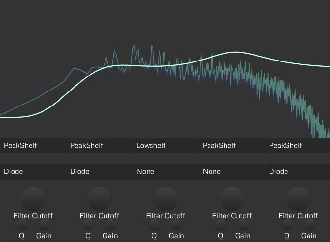

# Abrasive

A colorful mixing EQ.

Abrasive builds on top of an emulation of a State Variable Filter to provide with a flexible equalizer. The color comes
in when driving the EQ into saturation, which adds character into the track. Designed to facilitate tasks such as adding
high-frequency excitement, low-end groove, it excels in broad-brush tonal tuning, while still being useful for more
surgical tasks.

Abrasive is pre-alpha software.

## Download

You can download the latest nightly build from the Release page of the GitHub project, or find a permalink to the latest
nightly builds [here](https://nightly.link/SolarLiner/valib/workflows/build/master).

## Tips

- Use a "Peak Sharp" band with the "Diode" resonance clipping on your bass and/or kick, turning the brand into a parallel
  saturated band-pass with lots of overtones to cut through the mix. Dial the gain and drive knobs to taste.
- Use a gentle "High shelf" band by using a low Q, and turn on the Drive knob high and dial in the gain of the high shelf to
  taste. This turns the band into a parallel exciter which can brighten your high-end by saturating the high frequencies.